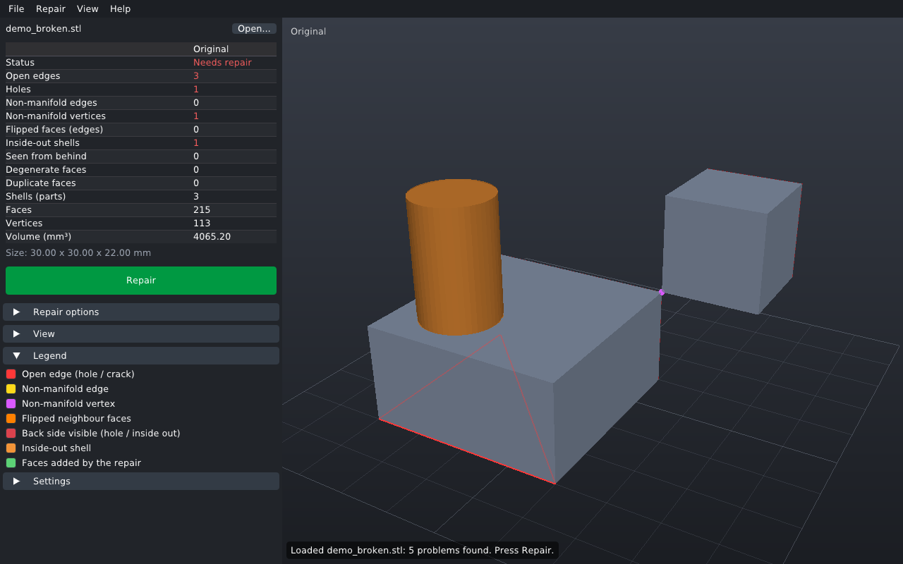
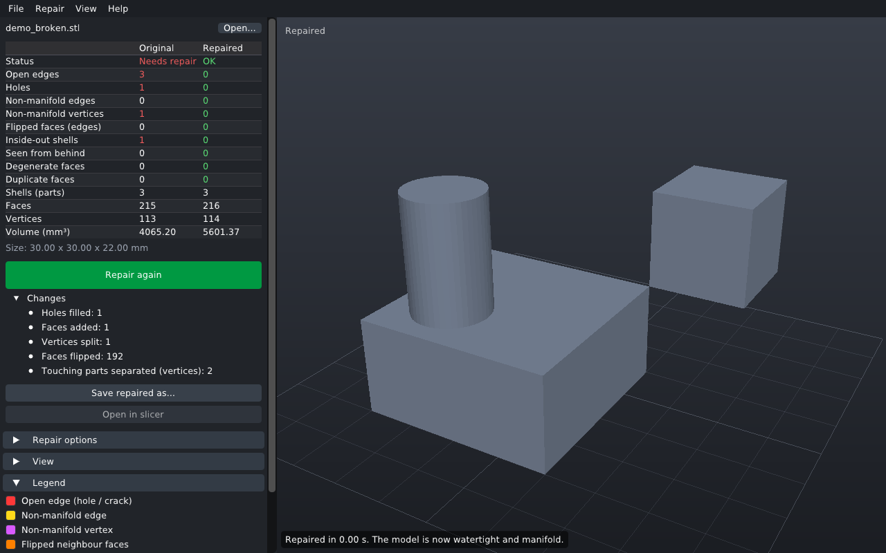
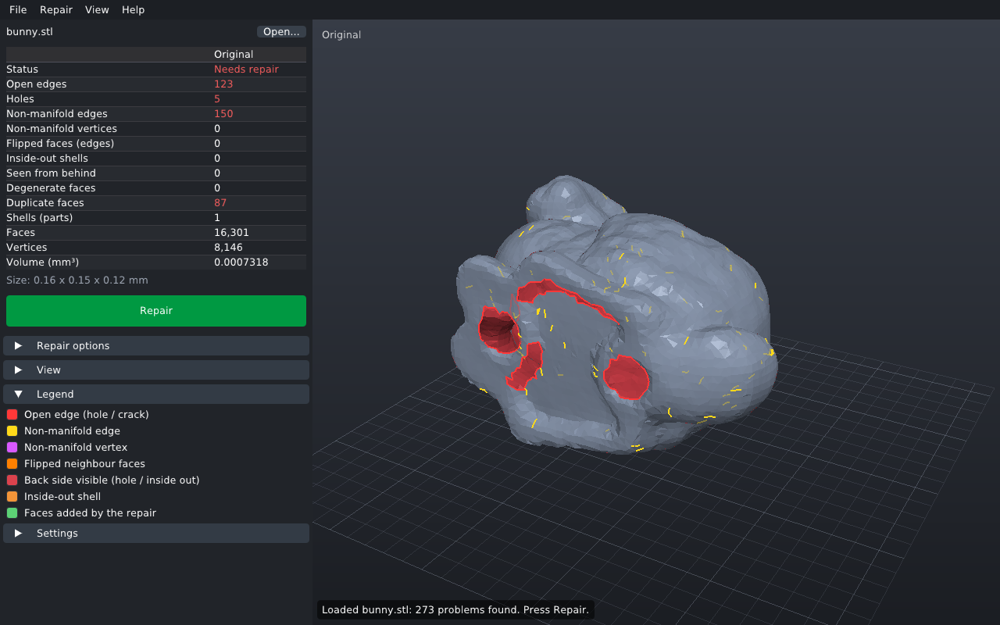
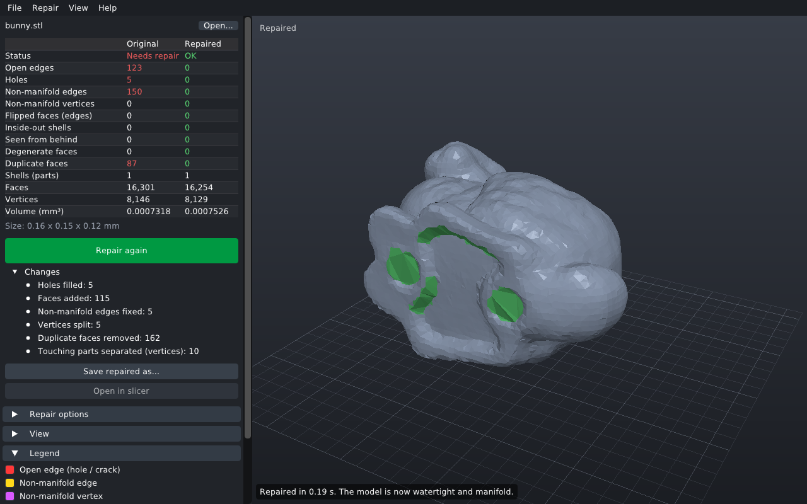

# MeshRepair

Repairs broken 3D printing meshes on Linux: **open edges, holes and cracks,
non-manifold edges and vertices, flipped normals, inside-out parts, duplicate
and degenerate faces.**

Bambu Studio, OrcaSlicer and PrusaSlicer have a **Fix model** function, but
only on Windows: it relies on the Windows 10 3D printing SDK (netfabb). On
Linux those slicers only warn about "non-manifold edges" and leave the model
broken. MeshRepair is an open replacement that works on every distribution.
You can use it in three ways:

1. **`meshrepair-gui`**: open an STL / 3MF / OBJ, see exactly what's wrong,
   repair it, save it, or send it straight to Bambu Studio / OrcaSlicer /
   PrusaSlicer.
2. **`meshrepair`**: the same repair on the command line, for batch jobs and
   scripts.
3. **Inside Bambu Studio**: a small source change that makes *Fix model* work
   on Linux exactly like on Windows. See
   [integration/bambustudio](integration/bambustudio/README.md).

| Before | After |
|---|---|
|  |  |
|  |  |

## Install

Requirements: a C++17 compiler, CMake ≥ 3.13 and GLFW 3.3+ (for the viewer).
If GLFW isn't installed, it's downloaded and built automatically. The viewer
uses `zenity` or `kdialog` for file dialogs when one is installed, and its own
file browser otherwise.

**Arch Linux**

```sh
git clone https://github.com/oreo1298/MeshRepair.git
cd MeshRepair/packaging/arch && makepkg -si
```

**Any distribution, from source**

```sh
# Debian / Ubuntu:  sudo apt install g++ cmake ninja-build libglfw3-dev
# Fedora:           sudo dnf install gcc-c++ cmake ninja-build glfw-devel
# openSUSE:         sudo zypper install gcc-c++ cmake ninja libglfw-devel
# Arch:             sudo pacman -S --needed base-devel cmake ninja glfw
git clone https://github.com/oreo1298/MeshRepair.git
cd MeshRepair
cmake -S . -B build -G Ninja -DCMAKE_BUILD_TYPE=Release
cmake --build build
ctest --test-dir build            # optional
sudo cmake --install build        # installs meshrepair, meshrepair-gui, menu entry, icon
```

Building only the library and command line tool needs nothing but a compiler:
pass `-DMESHREPAIR_BUILD_GUI=OFF`.

## Using the viewer

```sh
meshrepair-gui model.stl
```

Or open a file from the menu, drop one on the window, or use *Open with →
MeshRepair* in your file manager.

* The table on the left lists every problem. The view highlights them: **red
  lines** are open edges (holes, cracks), **yellow** non-manifold edges,
  **purple dots** non-manifold vertices, **orange** flipped neighbours and
  inside-out parts, and a **red surface** is the back side of the surface,
  seen through a hole or because the part is inside out.
* **Repair** (Ctrl+R) runs in the background and can be canceled. Afterwards
  the table compares before and after, faces added by hole filling are shown
  in green, and *Tab* switches between the original and the repaired mesh.
* **Save repaired as…** (Ctrl+S) writes STL, 3MF or OBJ.
* **Open in Bambu Studio** passes the repaired model to the slicer. Native
  installs found in `PATH` (`bambu-studio`, `bambustudio`, …), the Flatpak and
  AppImages in `~/Applications`, `~/Downloads` or `~/.local/bin` are detected,
  as are OrcaSlicer and PrusaSlicer. A custom command can be set under
  *Settings*.
* Mouse: left drag rotates, right drag pans, the wheel zooms, double click
  fits. Keys: `F` fit, `W` wireframe, `I` toggle problem markers, `0`-`6`
  standard views.

Set `MESHREPAIR_FILE_DIALOG=builtin` (or `zenity` / `kdialog`) to force a
particular file dialog.

## Using the command line tool

```sh
meshrepair model.stl                     # writes model_repaired.stl
meshrepair model.3mf -o fixed.3mf        # every object of a 3MF is repaired separately
meshrepair -i *.stl                      # repair in place
meshrepair --check *.stl                 # only report, exit status 2 if anything is wrong
meshrepair --json --check part.obj       # machine readable report
```

Options: `--no-fill`, `--max-hole N`, `--no-stitch`, `--stitch-tol MM`,
`--weld-tol MM`, `--min-shell-ratio R`, `--keep-zero-volume`, `--no-orient`,
`--no-separate`, `--ascii`. See `meshrepair --help`.

Exit status: 0 the result is clean, 2 problems remain (or were found with
`--check`), 1 error.

## What the repair does

The library (`libmeshrepair`, plain C++17 without dependencies) runs these
steps:

1. **Merge vertices** that coincide (STL stores every triangle separately)
   and remove faces with invalid indices or coordinates.
2. **Remove degenerate and duplicate faces.** Two copies of a face with
   opposite orientation cancel out: that's the shared wall of two solids
   exported together.
3. **Close cracks:** boundary vertices lying on the edge of the neighbouring
   patch (T-junctions) are inserted into that edge, and nearly coincident
   boundary vertices are merged. Mismatched tessellation along patch borders
   is the most common cause of "open edges" in CAD exports.
4. **Fix non-manifold edges and vertices.** Around an edge shared by more than
   two faces, faces are paired by the solid wedges they bound, preferring
   faces of the same surface and treating flat stray sheets (internal walls,
   fins) as leftovers. The edge is then split so each pair gets its own copy.
   Vertices where surfaces touch in a single point are split the same way.
5. **Orient faces consistently** by propagating orientation across shared
   edges.
6. **Fill holes** with the minimum-dihedral-angle triangulation by Liepa
   (flat caps for flat holes, smooth patches for curved ones). Very large holes
   are split first.
7. **Flip degenerate "cap" triangles** away by edge flips.
8. **Orient shells.** Outermost parts face outward. Nested parts keep the
   orientation the input mostly had: a cavity stays a cavity, an overlapping
   solid stays a solid. A final check from outside, the same 46-ray test Bambu
   Studio uses, flips parts that are only ever seen from behind.
9. **Remove zero-volume shells**, such as the leftovers of internal walls.
10. **Separate touching parts** by a few micrometres. STL can't store which
    vertices are shared, so parts touching in an edge or point would become
    non-manifold again when a slicer re-merges vertices by position.

The result is checked with the same definitions Bambu Studio uses (open edges,
non-manifold edges and vertices, reversed faces), after rounding to float and
merging vertices by position the way a slicer loads an STL.

## Verification

* `ctest` runs a suite of constructed defects (missing faces and sides,
  flipped faces, duplicates, two bodies sharing an edge, a vertex or a face,
  internal walls, fins, T-junction cracks, offset cracks, cavities, Möbius
  strips, random triangle soup, NaNs, cancellation), 3MF / ZIP / DEFLATE round
  trips, and a 330 000 face performance test, which takes about 3 s.
* 197 meshes from the trimesh and CGAL test suites (many deliberately broken)
  were repaired and checked independently with trimesh and with Bambu
  Studio's own `MeshDiagnostics.cpp`. 134 came out watertight, manifold and
  correctly oriented, 55 flat test patches were rejected as having no volume,
  and 8 single open sheets fold over themselves when closed (details in
  [integration/bambustudio](integration/bambustudio/README.md#how-this-was-verified)).
* CI builds and tests on Arch Linux, Fedora, Debian and Ubuntu (x86-64 and
  aarch64), builds the Arch package with `makepkg` using Arch's own compiler
  flags (with and without FMA, as `-march=native` enables it), renders the
  viewer under Xvfb, and checks the Bambu Studio installer against Bambu
  Studio master every week.

## Limitations

* **Self-intersections are not removed.** Overlapping parts stay overlapping.
  Slicers handle that fine (they take the union), so it doesn't affect prints.
* **Zero-thickness surfaces can't become solids.** A model made only of
  single-sided sheets (a plane, a flat logo without thickness) is reported as
  "has no volume" instead of being turned into something arbitrary. A single
  open, curved sheet can be closed, but the result folds over itself and still
  shows as "seen from behind".
* **The standalone tools write geometry only.** Colour, painting and slicer
  settings in a Bambu project 3MF aren't kept. Use the
  [Bambu Studio integration](integration/bambustudio/README.md) for that: there
  the repair happens inside Bambu Studio and painting is carried over.
* The viewer merges the objects of a multi-object 3MF into one mesh. The
  command line tool keeps them separate.

## Repository layout

```
libmeshrepair/          the repair library (+ STL / OBJ / 3MF I/O)
apps/cli/               meshrepair command line tool
apps/gui/               meshrepair-gui (Dear ImGui + GLFW + OpenGL 3.3)
tests/                  test suite
integration/bambustudio installer, patch and verification for Bambu Studio
packaging/              Arch PKGBUILD, desktop entry, icon, AppStream metadata
third_party/imgui/      Dear ImGui 1.92.9b (MIT license)
```
